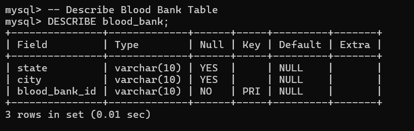
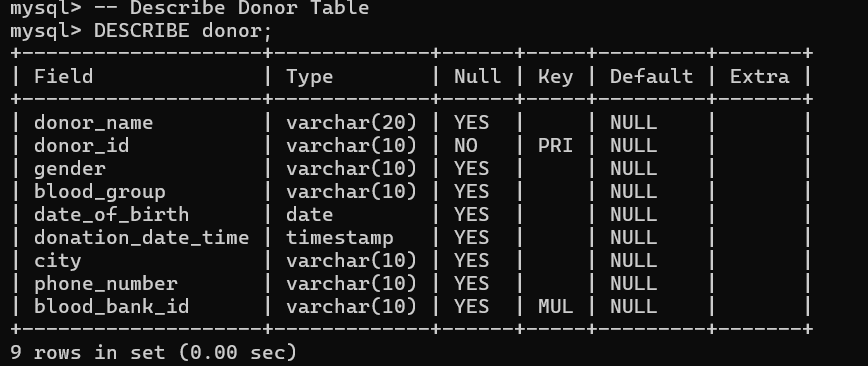
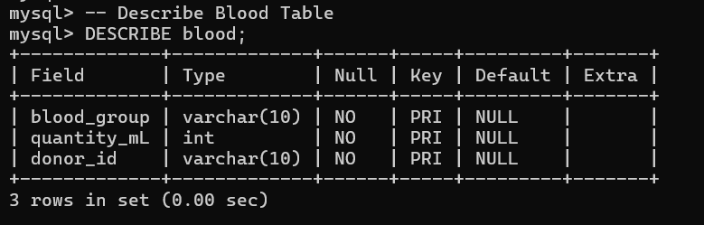
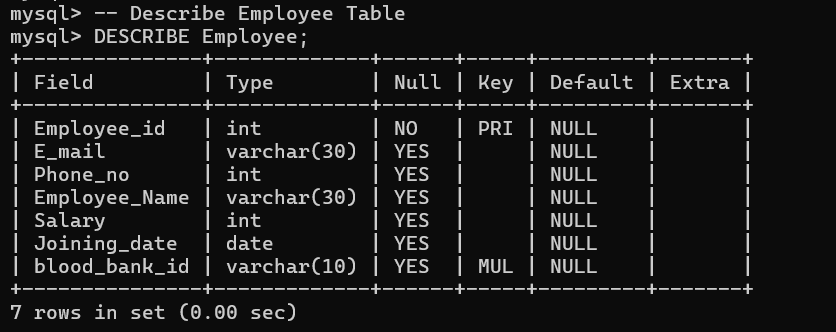
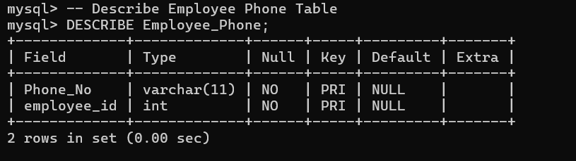
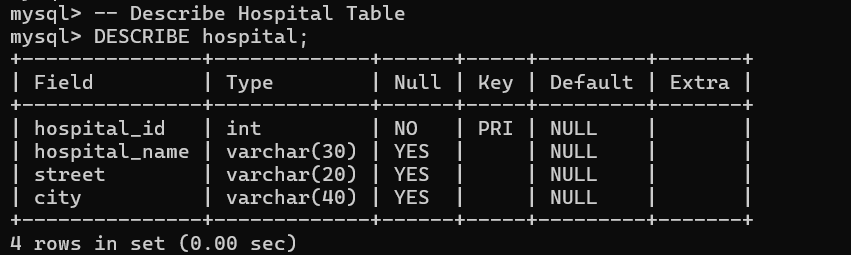
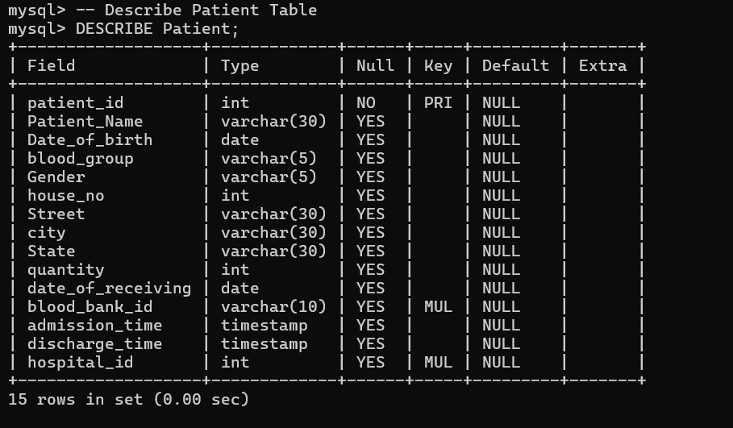
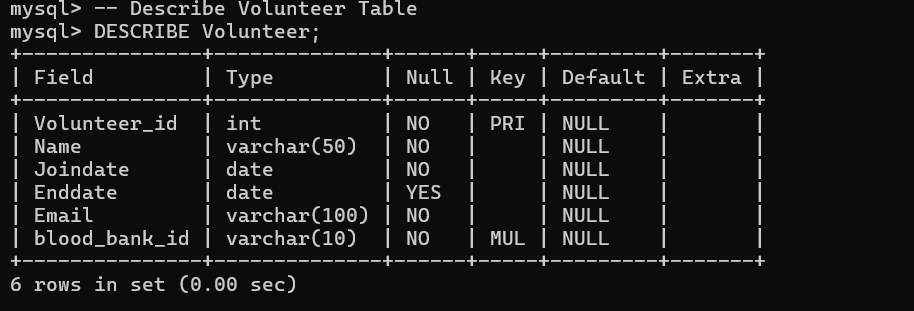
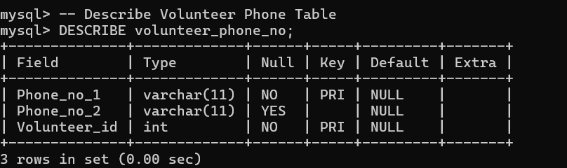
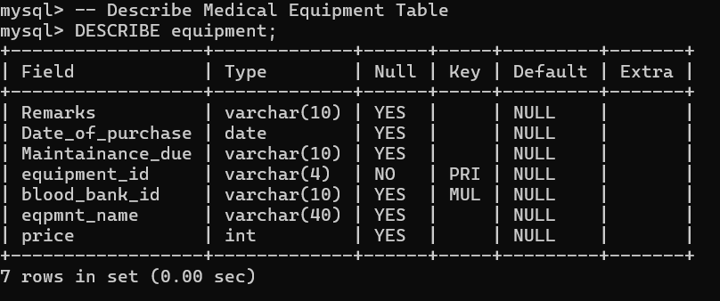

# Tables

This document provides detailed information about each table in the Blood Bank Management System database, including columns, data types, primary keys, and foreign keys.

## Blood Bank Table
The `blood_bank` table stores information about blood banks.

- **Primary Key**: `blood_bank_id`

## Donor Table
The `donor` table stores information about donors.

- **Primary Key**: `donor_id`
- **Foreign Key**: `blood_bank_id` references `blood_bank(blood_bank_id)`

## Blood Table
The `blood` table stores information about blood donations.

- **Primary Key**: `(donor_id, blood_group, quantity_mL)`
- **Foreign Key**: `donor_id` references `donor(donor_id)`

## Employee Table
The `Employee` table stores information about employees working at blood banks.

- **Primary Key**: `Employee_id`
- **Foreign Key**: `blood_bank_id` references `blood_bank(blood_bank_id)`

## Employee Phone Table
The `Employee_Phone` table stores multiple phone numbers for employees.

- **Primary Key**: `(Phone_No, employee_id)`
- **Foreign Key**: `employee_id` references `Employee(Employee_id)`

## Hospital Table
The `hospital` table stores information about hospitals.

- **Primary Key**: `hospital_id`

## Patient Table
The `Patient` table stores information about patients.

- **Primary Key**: `patient_id`
- **Foreign Keys**:
  - `blood_bank_id` references `blood_bank(blood_bank_id)`
  - `hospital_id` references `hospital(hospital_id)`

## Volunteer Table
The `Volunteer` table stores information about volunteers.

- **Primary Key**: `Volunteer_id`
- **Foreign Key**: `blood_bank_id` references `blood_bank(blood_bank_id)`

## Volunteer Phone Table
The `Volunteer_Phone` table stores phone numbers for volunteers.

- **Primary Key**: `(Volunteer_id, Phone_no_1)`
- **Foreign Key**: `Volunteer_id` references `Volunteer(Volunteer_id)`

## Medical Equipment Table
The `equipment` table stores information about medical equipment used in blood banks.

- **Primary Key**: `equipment_id`
- **Foreign Key**: `blood_bank_id` references `blood_bank(blood_bank_id)`
